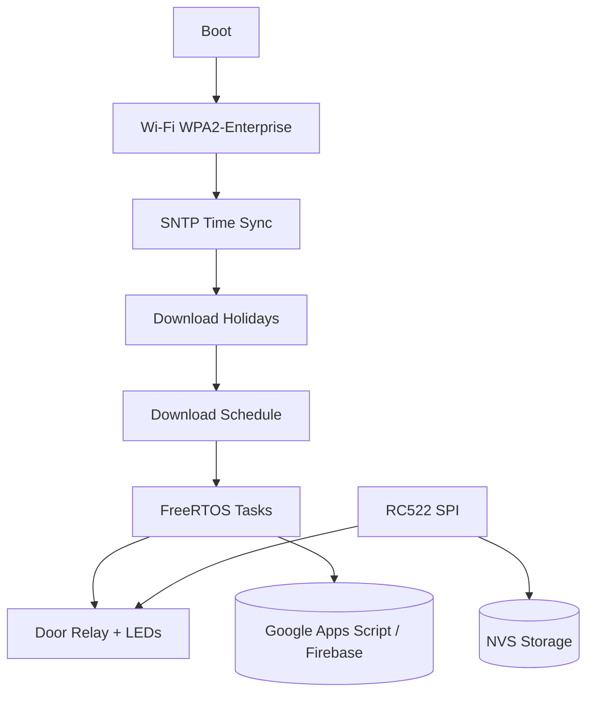

# 🚪 ESP32 Door Access Control – WPA2-Enterprise + RFID + Smart Schedule

[]()
[]()
[]()
[]()

---

## 📘 Table of Contents
1. [Overview](#-overview)
2. [System Architecture](#-system-architecture)
3. [Hardware Pinout](#-hardware-pinout)
4. [Main Features](#-main-features)
5. [Installation & Build](#-installation--build)
6. [Internal Workflows](#-internal-workflows)
7. [Folder Structure](#-folder-structure)
8. [Modules Overview](#-modules-overview)
9. [Logs & Debugging](#-logs--debugging)
10. [Technical Roadmap](#-technical-roadmap)
11. [Author & License](#-author--license)

---

## 🧭 Overview

A complete embedded firmware for **smart door access** and counter management, built with **ESP-IDF v5.5**, supporting **WPA2-Enterprise (TTLS/PAP)** authentication, **RFID access (RC522)**, and **remote scheduling** via **HTTP/REST APIs** (Google Apps Script or Firebase backend).

The firmware connects to a secured enterprise Wi-Fi network, synchronizes time via NTP, downloads schedule and holiday data from the cloud, and triggers a physical door relay accordingly.

---

## 🧠 System Architecture



---

## 🛠️ Hardware Pinout

| Component  | GPIO | Function       |
|-----------:|:----:|----------------|
| RC522 SCK  |  18  | SPI Clock      |
| RC522 MOSI |  23  | SPI MOSI       |
| RC522 MISO |  19  | SPI MISO       |
| RC522 CS   |   5  | Chip Select    |
| RC522 RST  |  22  | Reset          |
| Relay      |  27  | Door trigger   |
| Green LED  |   4  | Access granted |
| Red LED    |   2  | Access denied  |

---

## ⚙️ Main Features

- ✅ WPA2-Enterprise connection (TTLS/PAP)  
- ✅ SNTP automatic time synchronization  
- ✅ Door control via GPIO relay  
- ✅ Visual feedback with LEDs  
- ✅ RFID authentication (RC522 over SPI)  
- ✅ Master key for developer mode (add/remove cards)  
- ✅ Cloud-based schedule + holiday sync  
- ✅ Remote reset via HTTP  
- ✅ Persistent NVS storage (cards + counter)  
- ✅ Modular, multi-task architecture (FreeRTOS)

---

## 🔧 Installation & Build

### 1️⃣ Requirements
- ESP-IDF ≥ 5.5  
- Python ≥ 3.8  
- `idf.py` and `esptool.py` in PATH  

### 2️⃣ Configure
```bash
idf.py set-target esp32
idf.py menuconfig
```
Set:
```
→ WiFi Configuration
  ↳ SSID, Identity, Username, Password
→ Backend URLs
  ↳ TARGET_URL, COUNTER_URL, AGENDA_URL, RESET_URL, FERIADOS_URL
→ Master Key Hash
```

### 3️⃣ Build & Flash
```bash
idf.py build
idf.py flash monitor
```

---

## 🧾 Internal Workflows

### 📡 Boot & Connection
1. Initialize NVS  
2. Connect via WPA2-Enterprise  
3. Wait for IP  
4. Sync NTP time  

### 📅 Schedule & Holidays
1. Fetch from remote HTTP endpoints  
2. Parse and cache in RAM  
3. Execute triggers on matched times (weekday/holiday aware)  

### 🔐 RFID Flow
- Master key toggles Developer Mode  
- **Developer Mode**: add/remove card UIDs (persist in NVS)  
- **Normal Mode**: validate UID → pulse relay → update counter/cloud  

### ⚙️ Automated Execution
- Compare current time with schedule  
- Validate weekday vs holiday state  
- Pulse relay, update local counter and backend (HTTP PUT)

---

## 📂 Folder Structure

```
main/
├── app_main.c
├── core/
│   ├── app_ctx.c / .h
│   ├── config.h
│   └── log_tags.h
├── drivers/
│   ├── door.c / .h
│   └── rfid.c / .h
├── net/
│   ├── wifi_enterprise.c / .h
│   ├── time_sync.c / .h
│   └── http_simple.c / .h
├── storage/
│   ├── kv_store.c / .h
│   ├── counter_store.c / .h
│   ├── cards_store.c / .h
│   └── master_key.c / .h
├── domain/
│   ├── agenda.c / .h
│   └── holidays.c / .h
└── tasks/
    ├── task_pulse.c / .h
    ├── task_reset.c / .h
    ├── task_agenda_fetch.c / .h
    ├── task_agenda_exec.c / .h
    └── task_time_log.c / .h
```

---

## 🧩 Modules Overview

| Module  | Responsibility                                   |
|---------|---------------------------------------------------|
| core    | Global context, configuration, log tags           |
| drivers | Low-level hardware (relay/LEDs, RC522)            |
| net     | WPA2-Enterprise Wi-Fi, SNTP, HTTP helpers         |
| storage | NVS persistence (counter, authorized cards, keys) |
| domain  | Pure logic (schedule parsing, holidays)           |
| tasks   | FreeRTOS orchestration and periodic jobs          |

---

## 🪵 Logs & Debugging

Use:
```bash
idf.py monitor
```

**Common log tags:**

| Tag     | Purpose                 |
|---------|-------------------------|
| `APP`   | Main initialization     |
| `RFID`  | Card events / dev mode  |
| `WIFI`  | WPA2 connection status  |
| `AGENDA`| Schedule execution      |
| `HTTP`  | Cloud communication     |
| `RESET` | Remote reset handling   |

---

## 🧱 Technical Roadmap

| Category        | Next Steps                                                |
|-----------------|-----------------------------------------------------------|
| Reliability     | Centralized queue for pulse events                        |
| Security        | Replace CRC32 with HMAC-SHA256; enable NVS encryption     |
| Networking      | HTTPS + certificate validation (CA bundle / pinning)      |
| Domain          | Replace ad-hoc parsing with cJSON                         |
| Testing         | Unit tests for schedule/holidays logic                    |
| Monitoring      | Watchdog, heap usage, uptime counters                     |
| Docs            | Wiring diagrams and hardware schematics in `/docs`        |

---

## 👨‍💻 Author & License

**João Victor Valerio**  
Developer – IMECC / UNICAMP  
jvalerio@unicamp.br • https://github.com/joaovaleri • https://www.linkedin.com/in/joao-valerio-dev/  

**License:** MIT
